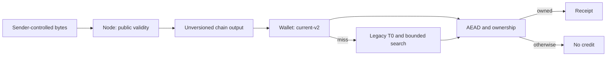
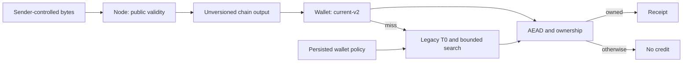
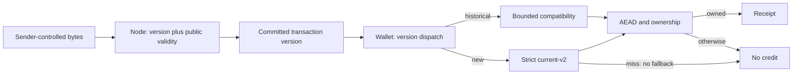

# RFC: Explicit versioned PQ delivery, bounded future scans, preserved old funds

## Decision

Proposed for maintainer review, 2026-09-08 UTC. We are asking whether future PQ
transactions should select a single delivery interpretation by consensus,
instead of requiring every receiver to keep trying historical contexts.
This document requests design agreement and an implementation review; it does
not select an activation height or authorize a network upgrade. This is a
documentation/evidence PR: no runtime, build, wire, or activation setting changes.
It is independent of [bounded recovery PR #28](https://github.com/discretecoin/discrete/pull/28)
and must not delay recovery fixes.

## Executive Recommendation

Option 1, **bounded compatibility without a fork**, preserves the existing
unversioned format and controls the legacy range per wallet. Option 2,
**version-gated strict-v2 delivery**, introduces a transaction version whose
outputs are interpreted only using `outContext-v2`, while preserving a separate
historical recovery path.

I recommend Option 2 for a coordinated upgrade, with Option 1 retained until its
migration gates pass. The objective is precise: a new-format output must never
trigger legacy T-search. We cannot honestly promise that its ciphertext was
correctly encrypted for an intended recipient merely because it carries that
version. Receiver-side authenticated recognition remains the payment boundary.

The stronger end-to-end evidence is a 14,804-block historical snapshot through
an isolated daemon and NodeRpcProxy: bound 64 versus 1 measured **3059.517 ms
versus 1926.155 ms median wall time (1.588x)**, with 21 alternating pairs.
A synthetic scanner-dominated wallet workload measured 6.640x; it is not the
production speedup claim. Neither experiment is an activated strict-v2 fork;
bound 1 still includes legacy T0. [Raw data, methods and limitations](EVIDENCE.md)
are part of this PR.

## Evidence

The RFC base is canonical `3e8ef0bad719c6ac6304674f76df52cc5aecbea7`, refreshed
before publication. I inspected Core `05cb1424ba9cea19bf3fa0630b647b9d6d9162cf` for
the receiver/synthetic experiment, and the recorded daemon experiment uses
`ed4a27005bdaa211ff68bfb31f7bd1f7013c7771`. The relevant
`include/CryptoNote.h`, `src/crypto_pq`, serialization, PQ validation, WalletLedger,
and WalletLegacy source paths have no committed difference against inspected PR
#28 head `a73507e8140a05db44456e41de06651614d5306d`. The experiment-only wallet
changes used for A/B timing are a separate artifact, not an upstream change.
The crypto/serialization/validation subset and WalletLedger/WalletLegacy have
no committed diff between `ed4a2700` and the RFC base. Recorded experiments were
not rerun as if they were tests of an implementation that this PR does not add.

The evidence map identifies what is observed and what we infer from it.

| Evidence | Finding or document | What it establishes |
| --- | --- | --- |
| E01 | Unversioned PQ output, `include/CryptoNote.h:62` and `src/CryptoNoteCore/CryptoNoteSerialization.cpp:286` | Observed: `kemCt`, `encPayload`, and `spendCommit` contain no delivery-version selector. |
| E02 | Scanner fallback, `src/crypto_pq/PqScan.cpp:87` and `:147` | Observed: one KEM decapsulation is followed by current-v2, legacy T0, then a bounded legacy search on misses. |
| E03 | Transaction version and signature body, `src/CryptoNoteCore/CryptoNoteSerialization.cpp:184`, `src/CryptoNoteConfig.h:395`, `src/crypto_pq/PqDerive.cpp:134` | Observed: the parser accepts transaction version 1 only; the signing digest includes the version. A version-2 constant and acceptance rule must be introduced, not assumed to exist. |
| E04 | [Receiver and derivation tests](EVIDENCE.md#receiver-tests) | Recorded and integrity-checked: 46 cases passed, including a review-only strict-v2 receiver, ownership/binding failures, historical T0 distinction, and version binding at hash level. |
| E05 | [Performance measurements](EVIDENCE.md#measurements) | Raw rows independently recalculated before publication: daemon-backed 1.588x and synthetic-wallet 6.640x median ratios describe different workloads. Neither is a strict-v2 fork measurement. |
| E06 | Historical recovery policy, `src/Wallet/WalletLedger.cpp` and `src/WalletLegacy/WalletLegacy.cpp` | Observed: effective legacy search includes the configured recovery range and WalletLegacy's ordinary floor of 64. Inferred: indiscriminate reduction can hide historical receipts. |
| E07 | Sender self-check and receiver authority, `src/crypto_pq/PqOutputBuilder.cpp:84`, `src/crypto_pq/PqScan.cpp:64`, `src/CryptoNoteCore/PqValidation.cpp` | Observed: normal output construction self-checks delivery; receiver checks authenticated plaintext and spend commitment; input spending validates authority separately. These do not prove correct encryption publicly. |

The main structural inference from E01 and E02 is that ambiguity is paid for by
every receiver, including receivers for whom an output is foreign. This is not
evidence of a live exploit, and the tests do not broadcast transactions.
The [evidence manifest](evidence/manifest.json) binds the published data and
review-only harnesses. Source is identified by immutable commits, not duplicated
as a source archive in this PR.

## Current Design And Failure Mode

We already have a T-independent `outContext-v2`: the receiver decrypts first and
learns T from authenticated plaintext. For a matching current output, widening
the legacy range does not add a search. The expensive path is a miss, especially
the ordinary foreign outputs that dominate most wallets' scans.

The current wire format does not distinguish that output from a historical
T-dependent one. A receiver therefore attempts the current context, legacy T0,
and any configured nonzero legacy indices. The upper bound is exclusive:
`maxT=64` covers historical T0..63; `maxT=1` still tries legacy T0; T4095 needs
`maxT=4096`. Consequently, “set T=1” is not the same operation as strict v2-only.

A malicious or defective sender can also supply an output that passes public
shape/spending rules but is not discoverable by the intended recipient. Adding
a version does not prove ciphertext correctness: the sender chooses the bytes
and can sign that choice. We should not describe such a payment as universally
burned; separate knowledge of the spending material or a custom receiver can
change spendability. What the ordinary receiver must guarantee is no false
credit and no expensive fallback in response to a new-version failure.

## Desired Invariants

- Every newly admitted `TX_PQ` transaction after activation selects strict
  `outContext-v2` delivery. Selection is committed in the transaction, not guessed
  from a decrypt failure or a daemon's optional annotation.
- For that version, each output gets one v2-context attempt per applicable view
  key and no legacy T-search, on success or failure. Aggregate spend-key matching
  remains a separate cost; this is not a claim of O(1) total work for every wallet.
- A failed authentication, context binding, or spend-commitment check never
  creates a recognized credit. No fallback turns failure into compatibility.
- Historical outputs remain recoverable with an explicit bounded policy and
  remain spendable in new transactions. The producing transaction's old version
  must not become an input rejection rule.
- Version rules are consistent across parsing, block validation, mempool,
  templates, all producers, wallet scanning, and reorg handling.

## Constraints And Non-Goals

We preserve existing key derivation, payload layout, amount binding, rho,
spend commitments, nullifiers, and payment semantics unless a separately reviewed
change is required. This is not a fee-policy redesign, a new encryption scheme,
or a guarantee against all resource spam. Existing size/output/work limits must
remain; KEM, signature verification, serialization, and key-set processing still
cost resources.

We do not activate the separately named signature transcript v2 by accident.
`outContext-v2`, a proposed transaction version 2, the reserved block-major
version, and `txSigningDigestV2` are distinct mechanisms. The inspected
`PQ_TRANSCRIPT_V2_HEIGHT` is unset (`UINT32_MAX`).

We also do not silently classify a restored old seed as new because its wallet
file was just created. There is already a creation-time mechanism:
`AccountBase::generate()` records a timestamp, and `WalletLegacy::initSync()`
passes a conservative timestamp to the synchronizer; the two-argument
`initWithKeys()` instead explicitly starts at height zero. This source evidence
does not establish every GUI flow, but it does invalidate a blanket claim that
all brand-new wallets necessarily pay a full genesis scan.

Fresh-seed birthday handling and imported-seed recovery are a separate product
track, with trustworthy conservative metadata and a recovery override. The
benchmarks deliberately start at zero to isolate the fallback cost. A format
upgrade by itself does not remove the unversioned historical scan cost.

## Before Architecture

The [before diagram](diagrams/versioned-pq-delivery-before.mmd) shows the
critical ownership boundary: the node establishes public validity, while the
wallet establishes whether it owns a receipt. The current wallet miss edge
enters legacy search; public validity does not resolve the delivery ambiguity.

## Options

### Option 1: Bounded compatibility without a fork

We can keep the deployed format and make the recovery policy explicit,
persistent, and bounded. This preserves interoperability and is the appropriate
near-term baseline. It also gives operators a way to recover older routes
without raising the global maximum for every user. Existing recovery fixes must
continue through their own review and recipient-side acceptance.

The limitation is structural: because the output has no reliable selector,
even a future historical ciphertext can still need the compatibility path.
For a genuinely new identity with no legacy receipt history, a carefully
declared reduced search mode can help, but we cannot infer that property for an
arbitrary restored seed. Increasing the bound restores discovery coverage and
also increases foreign-output work. This is an explicit product tradeoff, not a
cryptographic simplification.

The [Option 1 after diagram](diagrams/versioned-pq-delivery-bounded-compatibility-after.mmd),
paired with the before diagram, leaves the node/wallet boundary unchanged.
The changed authority is who selects the search budget.

| Change | Before | After | Security consequence | Cost |
| --- | --- | --- | --- | --- |
| Recovery selection | Ordinary default and configured recovery | Preserve wallet-owned, persisted bounds and clear recovery semantics | Bounds work without claiming elimination of ambiguity | State migration and user guidance |
| Format interpretation | Decrypt-and-fallback | Unchanged | Future old-context outputs still need compatibility | Continuing scan cost |

We introduce no new service, large index, or cryptographic primitive. Memory
impact should be small because the main new state is policy, but it has not been
profiled here. Reliability depends on carrying that policy across restart,
renaming, migration, and restoration; a lost setting can look like lost funds.
Rollback is comparatively simple before changing defaults: preserve recovery
metadata and return to the known-good compatible receiver. If fork coordination
is not feasible, those properties make this option preferable despite its
ongoing performance cost.

### Option 2: Version-gated strict-v2 delivery

We can move interpretation out of trial decryption and into an explicit
protocol rule. The suggested encoding reuses the existing transaction-version
field with a newly defined value, provisionally 2. All encrypted PqOutputs of
such a transaction are interpreted only with the current context. Maintainers
must confirm the numeric assignment; the rule is not simply “change every
transaction's version.”

The proposed activation scope is ordinary `TX_PQ` encrypted delivery. Current
`CoinbaseOutput` is a separate stripped commitment with no KEM/payload, and
`TX_FREE_REG` has no inputs or outputs. Neither needs an encryption-context
migration. Preserve their existing version/validation unless a separate protocol
reason is reviewed, and test them explicitly so a blanket parser or
`CURRENT_TRANSACTION_VERSION` edit does not break mining or registration.

At an agreed activation height H, nodes admit only the new version for newly
included `TX_PQ` transactions; transactions already mined below H keep their
historical validity. The parser needs to understand both formats, while
height-aware validation owns admissibility. Before H we retain current
admission rules unless a separately specified transition rule is adopted.
Mempool admission uses the expected next-block context, and crossing the boundary
requires revalidation of pooled transactions and templates. Old software will
reject the new version: this is a coordinated consensus upgrade, not merely a
wallet preference. Existing current-v2 senders using the old transaction version
also need an upgrade: rejecting obsolete writers is deliberate, but it is a
real compatibility cost.

There are smaller alternatives worth considering, rather than treating a
hard fork as the only possible encoding:

| Selector | What it gives us | Why it is not the recommendation by default |
| --- | --- | --- |
| Height-only wallet cutoff | Updated wallets can stop fallback after H without adding a wire field | An unchanged legacy sender can still submit an accepted old-format payment that the updated recipient does not discover. It lacks the desired explicit stale-writer rejection. |
| Mandatory canonical `tx_extra` marker | Can bind a delivery declaration in the existing signed body | A serious alternative if maintainers want an admission restriction with less wire disruption. Duplicate/unknown-tag grammar, every transaction type, historical parsers and deployed-reader behavior need proof before calling it backward compatible or a soft fork. It still cannot prove encryption correctness. |
| New `TX_PQ` transaction version | Unambiguous signed selector and explicit old-writer rejection; unknown versions fail closed | Coordinated incompatible upgrade and all-reader/writer inventory required. I recommend it only if that lifecycle boundary is worth the rollout cost. |

If maintainers can demonstrate that a canonical extra marker satisfies the same
invariants with less migration risk, we should prefer that encoding. The
non-negotiable part of this RFC is explicit interpretation plus retained
historical recovery, not attachment to the number 2.

On the receiving side, dispatch on the committed version selects a strict
scanner. That scanner performs the current KEM/context/AEAD/ownership path and
returns “not mine or invalid” on failure. It never calls the existing
compatibility helper, including its legacy T0 attempt. The isolated prototype
tests this receiver predicate by reusing the existing private decryption and
ownership functions; it does not implement version dispatch or the fork.
Sender self-checks must use this same strict predicate. The existing builder's
compatibility-capable helper is insufficient as a future v2-only contract.

The [Option 2 after diagram](diagrams/versioned-pq-delivery-version-gated-after.mmd),
paired with the before diagram, removes the new-version failure-to-legacy edge.
It deliberately does not add a node-side “correct encryption” guarantee.

| Change | Before | After | Security consequence | Cost |
| --- | --- | --- | --- | --- |
| Delivery selector | No wire distinction | Committed transaction version | Receiver need not guess new-format context | Parser, producer, consensus and SDK changes |
| Failed new-format decryption | Legacy fallback | Terminal no-credit result | Legacy-search amplification removed for that version | Older malformed/mislabelled delivery not auto-recovered |
| Old output handling | Compatible scanner everywhere | Historical scan path and unchanged spend authority | Historical money is not invalidated | Maintain dual history semantics |
| Activation | No delivery boundary | Explicit height-aware `TX_PQ` admission and revalidation | New old-version encrypted-delivery admission ends | Coordinated upgrade and reorg testing |

The resource gain comes from removing repeated legacy derivations on misses,
not from eliminating KEM work. Reusing an existing version field and adding a
branch should not require a substantial new memory structure; peak memory and
whole-node throughput still need measurement on the integrated candidate.
The reliability burden is more serious: one disagreement in height rules,
coinbase construction, or reorg policy can cause rejection or missed receipts.
That is why the historical spend test and fork-boundary matrix are release
gates rather than footnotes.

We should stage readers, writers, and test-network activation before choosing
H. Before activation, rollback can return to the compatible release while
retaining wallet data. After activation, reverting to an old node binary is not
a safe rollback; it requires a forward-compatible fix or a coordinated network
decision. A desktop UI must not label an incompatible old build as a recovery
solution for the upgraded chain.

## Comparison

This table separates a source-derived expectation from a measurement; there is
no composite score that can hide the migration cost.

| Dimension | Option 1 | Option 2 | Basis and validation |
| --- | --- | --- | --- |
| Security | Search remains bounded but ambiguous | Removes legacy search for new-version outputs; does not prove encryption correctness | Source-derived plus receiver tests; test every dispatch caller after integration |
| Performance | Bound controls foreign-output cost | Expected lower miss cost; historical section unchanged | Measured scanner/local-sync scope in test report; whole daemon/GUI comparison still needed |
| Memory | Small policy state; unprofiled | Small selector state expected; unprofiled | Hypothetical; compare peak working set on identical chains |
| Reliability | Compatibility retained; settings can lose recovery coverage | Simpler new-output interpretation, more complex fork boundary | Source-derived; restart, restore and reorg matrix |
| Operability | Explain and preserve recovery range | Coordinate node/wallet/SDK rollout and version support | Hypothetical; rehearsal on an isolated test network |
| Migration | No protocol fork | Consensus upgrade; old outputs and old seeds retained | Source-derived; old-output-to-new-transaction spend and rollback rehearsal |

We can improve scan cost locally with Option 1, but only Option 2 gives new
outputs a protocol-defined interpretation. Whether that benefit merits a fork
depends on measured end-to-end cost and the maintainers' upgrade schedule.

## Recommendation

I recommend Option 2 as the maintainer proposal, conditional on the activation
and compatibility gates below. Option 1 should remain the shipping fallback
until then; these test results do not authorize reducing every wallet's current
history coverage. A later fork does not retroactively erase the cost of scanning
the old unversioned section from genesis.

If the actual requirement is stronger—publicly reject every ciphertext that
does not correctly deliver the intended plaintext—this proposal does not meet
it. We would need a separately specified publicly verifiable relation and proof
system, or a recipient-assisted protocol, with independent privacy, availability,
size and verification-cost review. The KEM definition itself is not such a
proof; see [NIST FIPS 203](https://csrc.nist.gov/pubs/fips/203/final).
That larger project is deferred, not quietly claimed as solved by versioning.

## Evidence Coverage And Residual Risk

The remaining boundaries matter as much as the removed search edge.

| Evidence and concern | Option 1 | Option 2 | Tactical protection still needed |
| --- | --- | --- | --- |
| E01/E02 — Format ambiguity and fallback cost | Mitigates through bounded policy | Addresses new-version dispatch; historical ambiguity remains | Preserve bounded recovery until and after migration for old history |
| E03 — Version and signing body | Unaffected | Provides selector; existing digest binding can be retained | Explicit parser/consensus integration and signature tests |
| E04/E07 — Receipt integrity and authority | Preserves current checks | Preserves checks in strict receiver; node still cannot promise delivery | Builder self-check; recipients credit only recognized owned outputs |
| E05 — Performance evidence | Demonstrates local budget tradeoff | Supports direction, not a measured activated fork | Integrated repeatable workload and resource benchmarks |
| E06 — Historical recovery | Preserves compatible search | Preserves historical branch; careless migration can hide funds | Backup/restore, issued-range metadata, old-output spending tests |

An explorer entry, txid, or sender assertion is not proof of a payable merchant
receipt. A payment application must rely on its own recognized output, expected
recipient/invoice and amount, and its confirmation/reorg policy. The local
scanner tests do not validate a merchant integration. Production telemetry must
also preserve the scanner's “invalid or not mine” ambiguity; do not expose a
remote ownership oracle through diagnostics.

## Migration And Rollout

We retain existing recovery behavior while maintainers agree on the version,
all supported producers, and the height rule. New readers and strict-capable
writers are first exercised on isolated fixtures and a test network. Wallets
retain historical scan settings and conservative restoration metadata. After
the release gates pass, maintainers—not this proposal—choose H and publish the
minimum supported versions and upgrade instructions.

At H, old-version pending transactions need a clear rejection/rebuild response,
not silent reinterpretation. Reorgs below and across H must rebuild admission
context and wallet state from the actual chain. New transactions may spend old
outputs using their existing rho/authority; no conversion or forced sweep of
all historical funds is required by this design.

## Validation Plan

The [test report](EVIDENCE.md) records executed tests separately from the
following mandatory candidate-release gates. We must not call the fork tested
before the fork exists.

- Byte vectors: both supported transaction versions round-trip; unknown versions
  reject; version mutation invalidates the signed body; old vectors remain fixed.
- Dispatch: every new-version scanner path, including multi-key/common-view and
  hardware-backed consumers, makes no legacy attempt on success or failure.
  All applicable owned routes preserve exact rho, amount and routing metadata.
- Boundary: H-1/H/H+1 `TX_PQ` acceptance, unchanged stripped coinbase and empty
  registration paths, every other producer, mempool,
  templates and next-height admission agree. Cover queued old transactions,
  rebuild/retry and reorgs in both directions.
- Historical money: discover supported old T0 and nonzero routes, persist/reload
  and restore their recovery policy, spend those outputs in new-version
  transactions, and retain balance/history after detach/reattach.
- Failure isolation: corrupted payload and wrong context/authority never credit;
  a later valid receipt still succeeds; restart/cancellation does not corrupt
  persisted scan progress. Do not test against public networks or real funds.
- Resource budgets: identical height-zero workload and output mix, Release
  baseline/candidate, warmups, order-balanced repeats, wall/CPU/peak-memory and
  equality of owned outputs/history. Keep a separate historical-heavy workload.
  Require repeatable lower foreign-heavy scan CPU and no correctness difference;
  investigate median/p95 regressions beyond run noise on adjacent paths.
- Product acceptance: exact GUI reset/rescan/history/payment-link/compact-recipient
  flows, walletd receipt recognition, and supported-platform builds. Unit tests
  cannot establish those UI results.

## Implementation Work Packages

We would first freeze the wire/admission specification and vectors, then
implement the version-aware node and producer paths, then integrate strict and
historical receiver dispatch. Recovery-state migration and user-facing version
errors form a separate reviewable change. The final package is activation,
reorg, old-money-spend, full-sync and product acceptance evidence.

Each change needs a preserved known-good artifact and its own review. This
proposal's test harness is not a production scanner implementation. No submodule
pin, existing recovery PR, release, or network setting is changed by accepting
it for discussion.

## Open Questions

- Is a new `TX_PQ` transaction version worth the explicit stale-writer boundary,
  or can a canonical extra marker meet the same invariants more safely?
- Does the proposed narrow scope preserve all stripped coinbase and output-less
  registration paths, including reader and template assumptions?
- Which maintainers own producer/SDK inventory, activation policy and release
  coordination? How is next-height mempool behavior specified at the boundary?
- What historical routing metadata can restored wallets trust, and what
  conservative fallback is supported when metadata is missing?
- Is bounded receiver cost sufficient, or is publicly verifiable delivery a
  separately funded requirement with a different cryptographic design?
- What representative daemon/GUI chain, hardware and p95 budget should gate the
  final integrated performance claim?
